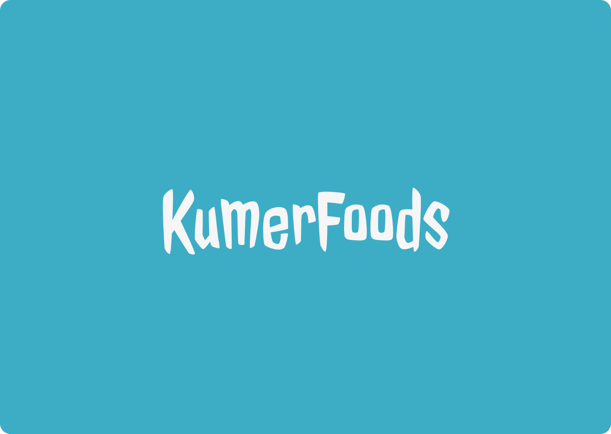

## Antes de ler

Este ReadMe está na  versão 0.1, não está completo ainda mas em breve ao Deploy tenho certeza(quase) que estará . Agradeço pelo interesse ;)

# KumerFoods

A experiência de ir em um restaurante e 
se deparar com um site/cardapio que não 
oferece o mínimo de UX, me fez na mesma 
hora pensar eu posso fazer melhor mesmo 
sendo iniciante.Assim surgiu a ideia de 
fazer cardápios. O KumerFoods é fictício mas confesso
 que se eu tivesse que criar 
um fastfood para mim seria exatamente igual kks 

## Aprendizados

Uso básico de React e alguns comando NPM e git(alguns momentos foram desafiadores kk) e,  + intimidade com Javascript.

## Stack

**Front-end:** React, JavaScript, CSS, HTML;                    

**Design:** Figma, Unsplash, Dribbble, (tem mais mas esqueci 😅).

#### By FanyLouise 🐣

[@fanylouise](https://www.github.com/fanylouise)

## Gostou?

Considere clicar na ⭐ do repositório ^^(y)

